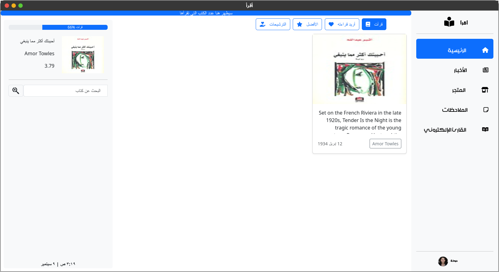

<div dir="rtl">

## اقرأ (قيد التطوير)
 مساعد قارئ تفاعلي متعدد المنصات مخصص للاستخدام لمحترفي القراءة العرب



## المميزات

<div dir="rtl">
- يمكنك تصفح الاخبار الثقافية أولاً بأول ومتابعة صدور الكتب الجديدة.
</div>
<div dir="rtl">
- بإمكانك معرفة الكتاب الأكثر مبيعاً اﻵن في الوطن العربي.
</div>
<div dir="rtl">
- من خلال الضغط على الملاحظات تستطيع تسجيل ملاحظاتك حسبما تريد.
</div>
<div dir="rtl">
-  دعم نافذة النوتة الخارجية بكثير من الميزات لتساعدك في تدوين الملاحظات.
</div>
<div dir="rtl">
- يمكنك إضافة تعليقك على كتاب ما.
</div>
<div dir="rtl">
- تم إضافة قاريء إلكتروني للكتب يساعدك في القراءة.
</div>
<div dir="rtl">
- توفير مصادر متنوعة للكتب لراحتك من معاناة البحث عن كتاب.
</div>
<div dir="rtl">
- نافذة يمكنك من خلالها متابعة ما تقرأه اﻵن من كتب ومدى تقدمك.
</div>
<div dir="rtl">
- شريط حالة يبين مدى إنجازك لهذا العام حتى اﻵن.
</div>
<div dir="rtl">
- يمكنك تغيير ما يعرض في الصغحة الرئيسية.
</div>
<div dir="rtl">
- قائمة ترشيحات بناء على ما تقرأه.
</div>
<div dir="rtl">
-التطبيق يدعم الوضع المظلم.
</div>
<div dir="rtl">
- لا داعي لإستخدام كثير من التطبيقات لإتمام عملية شراء الكتب فالان تستطيع بضغطة زر واحد شراء ما تريد. ( الشراء حاليا يتم من خلال موفر الكتب وليس التطبيق )
</div>

# جاري العمل ...
<div dir="rtl">
- البريد لمشاركة التجربة الخاص بك مع الأصدقاء.
</div>

## تثبيت اقرأ
يمكنك الحصول على إصدارات جاهزة من اقرأ لأنظمة 
[Linux](https://github.com/Mhmoud-Atiyah/Iqraa/releases/Linux/) - 
[Mac](https://github.com/Mhmoud-Atiyah/Iqraa/releases/Mac) - 
[Windows](https://github.com/Mhmoud-Atiyah/Iqraa/releases/windows/)

# يمكنك تثبيته يدوياً

أولاً، قم بتثبيت [NodeJS](https://nodejs.org/en/download/)
ثم قم بتنزيل الكود إلى المكان الذي ترغب فيه باستخدام الأمر التالي:
```
git clone https://github.com/Mhmoud-Atiyah/Iqraa.git
cd Iqraa
git submodule init
git submodule update
```

استخدم مدير الحزم [npm](https://www.npmjs.com/) لتثبيت أقراء.

```bash
npm install
```
ثم حسب النظام
```bash
npm run-script windows-package # لمستخدمي Windows
npm run-script mac-package # لمستخدمي mac
npm run-script linux-package # لأجهزة لينكس
```

## طور معي من الكود المصدر
استخدم مدير الحزم [npm](https://www.npmjs.com/) لبناء أقراء.

لتشغيله بدون تثبيت:
```bash
npm start 
npm install 
```
تثبيت
```
npm run-script build 
``` 

## المساهمة
أرحب بطلبات السحب (Pull Requests). يُرجى فتح مشكلة (Issue) أولًا لمناقشة أي تغييرات ترغب في إجرائها.
يرجى التأكد من تحديث الاختبارات حسب الاقتضاء.

## المكاتب المستخدمة
```    
"fontawesome": الأيقونات
"bootstrap": إطارات جاهزة
"epubjs":  للتعامل مع ملفات الكتب
"trix": نافذة النوتة
```
## تواصل
يُمكنك التواصل معي في أي وقت عبر البريد الإلكتروني:
[pyramido](mahmoudaboattia1999@gmail.com)

## الترخيص
حقوق التأليف والنشر (c) Pyramido. كل الحقوق محفوظة.
تُرخص بواسطة ترخيص [MIT](https://choosealicense.com/licenses/mit/).